# Practica de Github

Clonamos el proyecto de la libreria Jquery que lo mantiene en github.

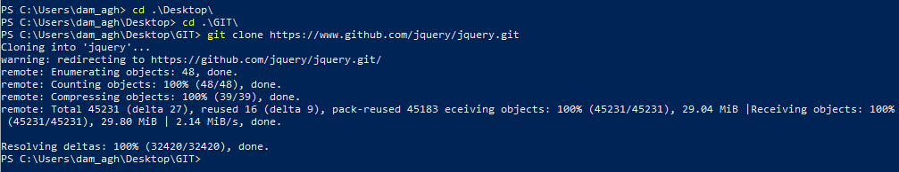

Mostramos los estados por los que ha pasado el proyecto.

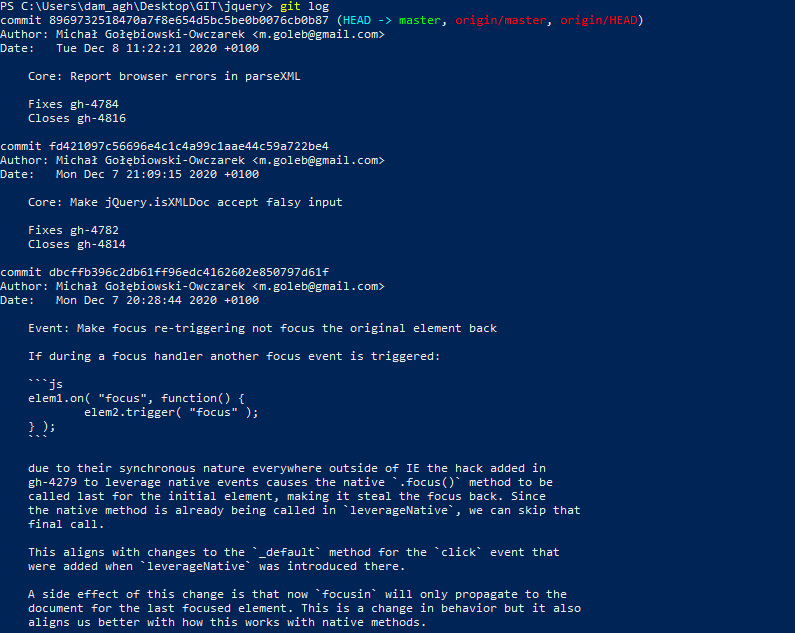

Creamos un directorio e inicializamos el repositorio.

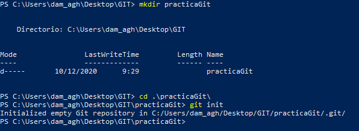

Visualizamos el estado del proyecto.

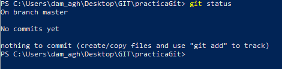

Pasamos el archivo de la zona de trabajo a la zona de preparación.

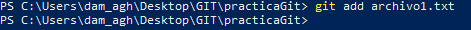

Visualizamos de nuevo el estado del proyecto.

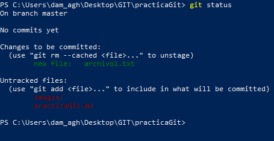

Realizamos el primer commit.

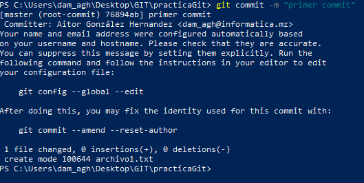

Y tras esto volvemos a visualizar el estado del proyecto.

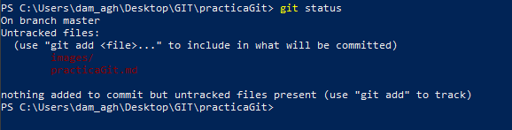

Pasamos el segundo archivo a la zona de preparación.

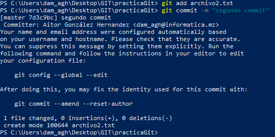

Repetimos con el tercer archivo.

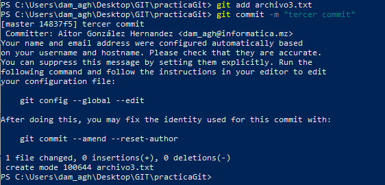

Hacemos un log para mostrar todos los cambios.

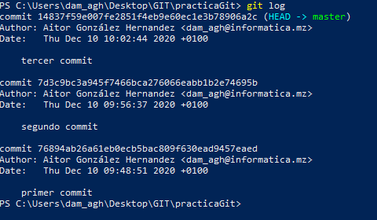

Modificamos el archivo 1 y comprobamos el estado.

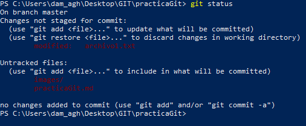

Pasamos el archivo 1 a la zona de preparación y modificamos los archivos 2 y 3 y repetimos.

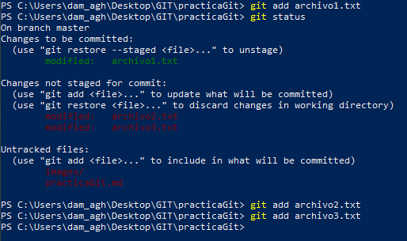

Realizamos un commit y mostramos todos los cambios realizados.

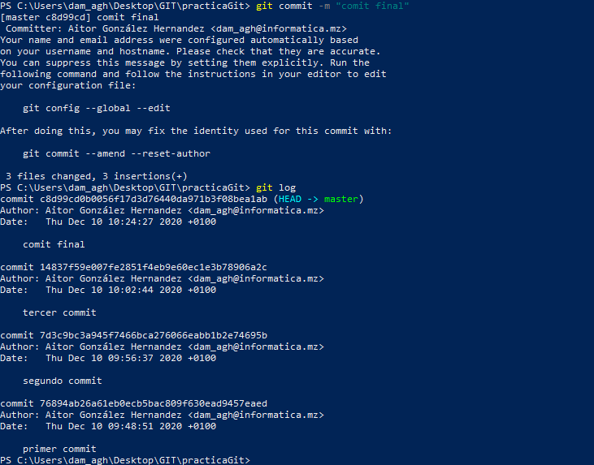